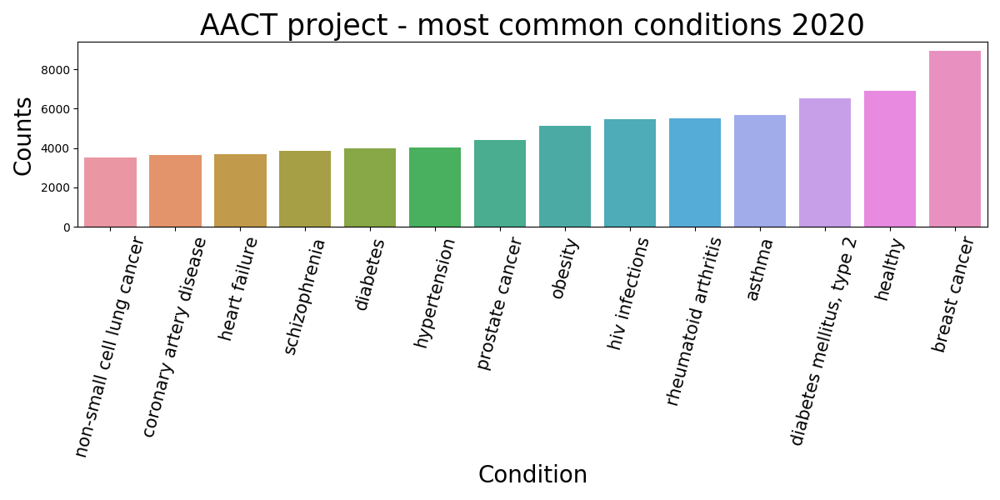
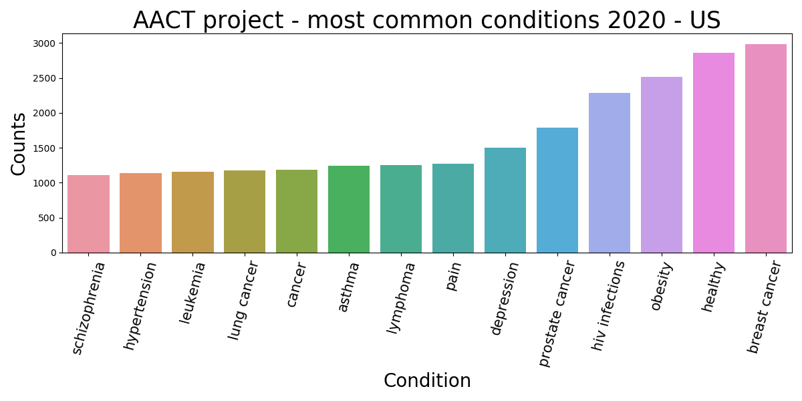
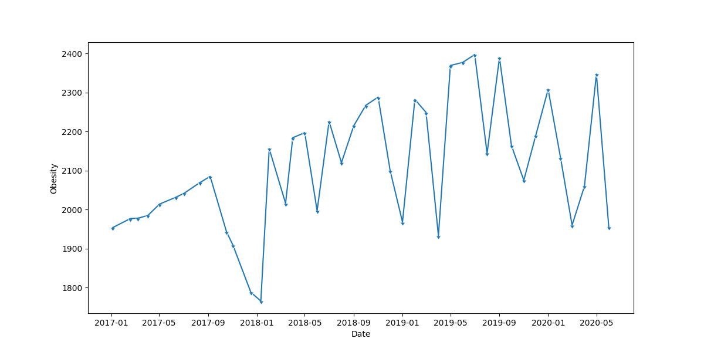

# AACT-Analysis
Visual exploration of the AACT dataset for 2020

CTTI has aggregated and restructured publicly available ClinicalTrials.gov data and made it available here as a relational database to facilitate analysis of the complete set of trials. This database is the Aggregate Analysis of ClincalTrials.gov (AACT).

By combining the two datasets "conditions" and "location_countries" inside the AACT database,
this project shows not only the most prevalent conditions globally but also per nation,
filtered by most represented countries (here US is shown). These plots are generated from date: 20200601.

